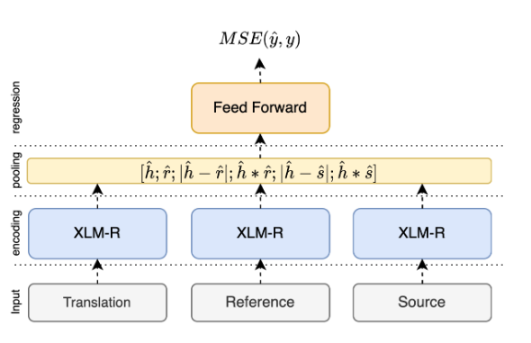

# MT-Marathon-Tutorial-2024

Welcome to the MT-Marathon tutorial on combining Tower and EuroLLM with MBR Decoding (a powerful decoding strategy that finds the best translation among several candidates).

## Install

To run this tutorial we only need a couple of libraries installed: [transformers](https://github.com/huggingface/transformers), [vllm](https://github.com/vllm-project/vllm), [mbrs](https://github.com/naist-nlp/mbrs)

Create a venv with python3.8 or above
```bash
python -m venv venv
source venv/bin/activate
```

Then install the respective libraries:
```bash
pip install transformers vllm mbrs
```

## Quick intro to Minimum Bayes Risk Decoding 

Minimum Bayes Risk (MBR) decoding is a powerful technique used in machine translation to improve the quality of generated translations. Unlike traditional methods that simply output the most probable translation, MBR considers multiple candidate translations and selects the one that minimizes the expected loss (or maximizes the expected gain) with respect to the true translation.

> You can read more about MBR in this [blogpost (10 minutes read)](https://suzyahyah.github.io/bayesian%20inference/machine%20translation/2022/02/15/mbr-decoding.html).

Here's how MBR works in the context of machine translation:

1) Generate candidates: First, we generate multiple candidate translations for a given source sentence using a translation model.
2) Define a utility function: We choose a metric (like BLEU, COMET, or METEOR) that measures the quality of a translation compared to a reference.
3) Compute expected utility: For each candidate, we compute its expected utility by comparing it to all other candidates, treating each candidate in turn as if it were the reference.
4) Select the best candidate: We choose the candidate with the highest expected utility as our final translation.

The key insight of MBR is that by considering multiple candidates and their relationships to each other, we can often find a translation that is better than any single candidate produced by the model. This is particularly useful when the model produces several good but slightly different translations, as MBR can help select the one that captures the most common and important elements across all candidates.

An alternative to MBR is QE reranking. In QE reranking we just score all translations with a given reference-free metric (like CometKiwi22) and pick the candidate with the highest score. The advantage of QE reranking is that it's linear with the number of candidates while MBR is a quadratic algorithm. Nevertheless, [several optimizations can be done to speed up MBR](https://mbrs.readthedocs.io/en/latest/list_decoders.html#efficient-mbr-decoders). The simplest one is, using COMET, caching the embeddings before computing the score. 

Recall COMET architecture:



The most expensive part of COMET is to compute the sentence embeddings for source, translation and reference (pseudo-reference in MBR). With that in mind, if we store those representations, the only quadratic part is to run the feed-forward network which is very fast.

## Generating samples with VLLM:

We will start our tutorial by generating samples for English-Spanish (MX) using [EuroLLM 1.7B](utter-project/EuroLLM-1.7B-Instruct). This model is a small multilingual model trained on 4T tokens where part of the data is parallel. The model supports 32 languages.

```bash
python generate_samples.py --lp en-es --num_candidates 20 --gpus 1 --output_file data/mbr/en-es-translations.jsonl
```

Take a look at the samples that were generated. If you don't understand Spanish, try another language pair. How different are the samples from each other?

**Exercise 1:** The code is using epsilon sampling. Change the code to use nucleus sampling instead. What changes do you observe?

**Exercise 2:** Implement a simple baseline with greedy decoding. Evaluate it in terms of comet using [comet-score command](https://github.com/Unbabel/COMET?tab=readme-ov-file#basic-scoring-command)

## MBR decoding:

Now that we have our translations, we can use the [mbrs](https://github.com/naist-nlp/mbrs) library to pick the best one. Here is an example for 1 sample:

### Python Example
```python
from mbrs.metrics import MetricCOMET
from mbrs.decoders import DecoderMBR
import pandas as pd

mbr_data = pd.read_json("data/mbr/en-es-translations.jsonl", lines=True)
HYPOTHESES = mbr_data["translations"].tolist()[1]
SOURCE = mbr_data["source"].tolist()[1]

# Setup COMET.
metric_cfg = MetricCOMET.Config(
  model="Unbabel/wmt22-comet-da",
  batch_size=32,
  fp16=True,
)
metric = MetricCOMET(metric_cfg)

# Setup MBR decoding.
decoder_cfg = DecoderMBR.Config()
decoder = DecoderMBR(decoder_cfg, metric)

# Decode by COMET-MBR.
# This example regards the hypotheses themselves as the pseudo-references.
# Args: (hypotheses, pseudo-references, source)
output = decoder.decode(HYPOTHESES, HYPOTHESES, source=SOURCE, nbest=1)

print(f"Selected index: {output.idx}")
print(f"Output sentence: {output.sentence}")
print(f"Expected score: {output.score}")
```

### Using CLI:

```bash
mbrs-decode data/mbr/en-es-samples-n10.txt \
    --num_candidates 10 \
    --nbest 1 \
    --source data/sources/en-es.txt \
    --references data/mbr/en-es-samples-n10.txt \
    --report report.txt --report_format rounded_outline \
    --decoder mbr \
    --metric comet \
    --metric.model Unbabel/wmt22-comet-da \
    --metric.batch_size 64 \
    --metric.fp16 true
    --output data/mbr/en-es-mbr-output.txt
```

**Exercise 3:** Open the report saved in `report.txt`. Explain why there were 1996 calls to the encode function and why the score function was called 99800 times?

**Exercise 4:** Use another MBR method that is more efficient. What are the gains? 

**Exercise 5:** Using [`comet-score command`](https://github.com/Unbabel/COMET?tab=readme-ov-file#basic-scoring-command), whats the result of your MBR outputs in terms of COMET (Unbabel/wmt22-comet-da)? What is the score if we inscrease the number of candidates to 50?

**Exercise 6:** Implement MBR with `bleurt` instead of COMET and measure the quality of the outputs using XCOMET.

**Exercise 7:** Experiment with different numbers of candidates (e.g., 10, 20, 50, 100) and plot how the COMET score changes and how other metrics change. At what point do you see diminishing returns?
